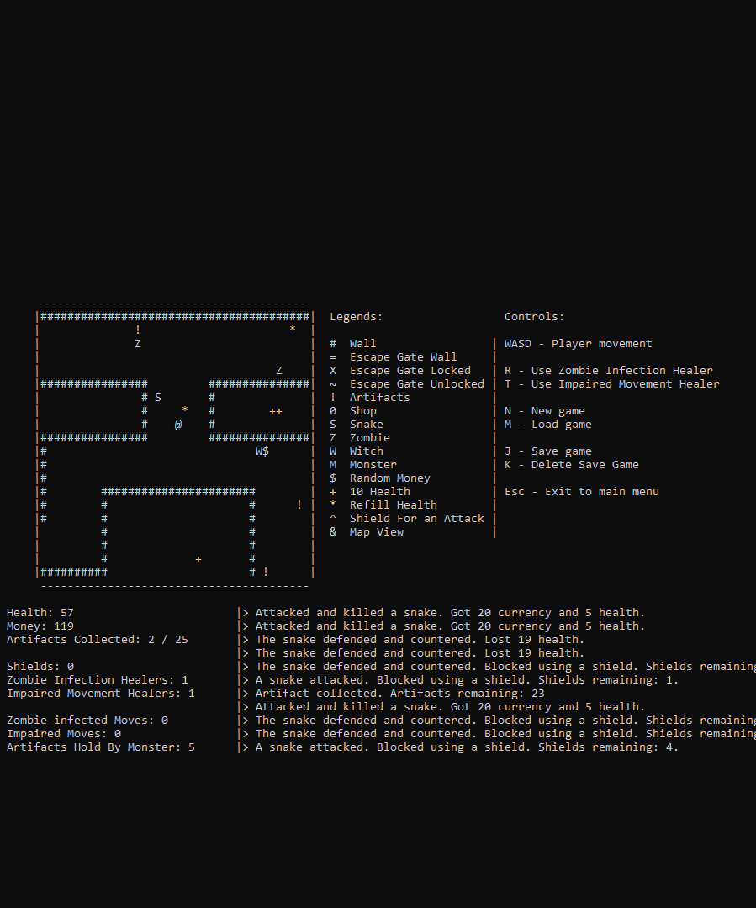
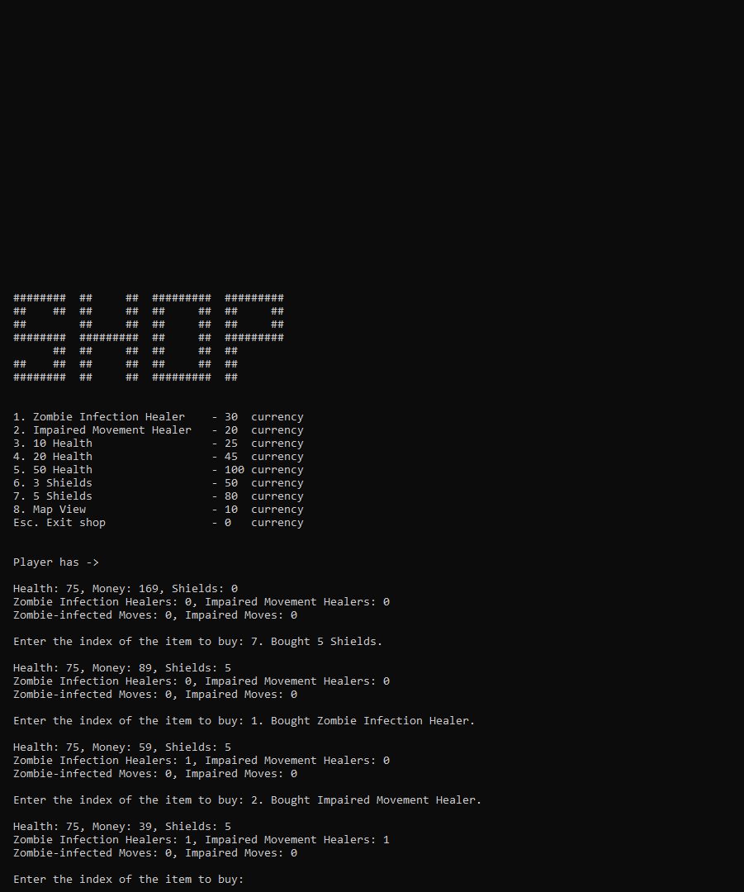

# Pursuit For Escape: Console Labyrinth

This is a dungeon-escaping game that can be played in the console. I got the idea of this game from this [video](https://www.youtube.com/watch?v=tVWckBaB5xo&list=PLSPw4ASQYyynKPY0I-QFHK0iJTjnvNUys&index=29&ab_channel=MakingGamesWithBen).

## Features

- The player has to escape the dungeon. But the escape gate doesn't unlock untill all the artifacts are found.

- There are 4 different type of enemies - Snake, Zombie, Witch, and Monster. Enemies move towards and attacks the player when in vicinity.

- Zombie can induce zombie infection and Witch can induce impaired movements to the player.

- A shop offering different kind of staffs for buying using currency.

- A map view.

 
 

## Screenshots

